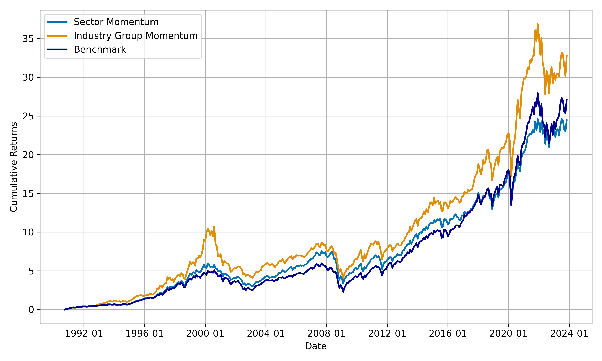

S&P500 Industry and Sector Momentum
==============================

Can the academic US UMD factor be profitably implemented by US sector and industry portfolios after transaction costs? 

Momentum in literature is generally exploited by long only or long/short strategies taking positions in single stocks. However, when attempting to implement these strategies one is confronted with high transaction costs incurred by high turnover. We investigate if the momentum anomaly is exploitable by taking positions in GICS sectors and industry groups as opposed to single stocks, thereby reducing transaction costs due to the lower number of portfolio holdings.

We show that while sector momentum portfolios are not able the beat the benchmark (S&P500) over the full time horizon, industry group momentum portfolio are able to achieve an excess return. 

Please see [SPX_Industry_Momentum](notebooks/SPX_Industry_Momentum.ipynb) for results.

We provide a fully replicable code including the relevant data to replicate our findings - please see below for requirements.



Requirements
==============================

Please clone the Github repo to a folder called "SPX-Industry-Momentum" inside your project folder. Should you wish to choose another folder name this is easily changable inside the notebook [SPX_Industry_Momentum](notebooks/SPX_Industry_Momentum.ipynb).
```bash
    git clone https://github.com/fabian-mugrauer/SPX-Industry-Momentum.git
```
Your final folder structure should look like this:
- `/Project folder` -> see 1. in the following list to set the `PROJECT_ROOT
  - `/SPX-Industry-Momentum` -> name amendable if wished

Please follow these steps to replicate our code:

1. Environment variable `PROJECT_ROOT` must point to the project folder; you can set it in the .env file, and python will rely on `python-dotenv` to set it. Please: 

    - Name the .env file "environment_variables.env"
    - Store the environment_variables.env file in the notebooks folder
    - Make sure the environment_variables.env file is UTF-8 encoded

2. Please install the following versions and channels of mamba and conda to recreate the virtual environment in 3.:
    - Mamba 1.4.2
    - Conda 23.3.1
      - Channel: defaults
      - Channel: conda-forge
3. Please `cd` into the SPX-Industry-Momentum folder inside your project folder and recreate and activate the virtual environment using mamba
   ```bash
    mamba env create -f spx_industry_mom.yaml
    ```
4. (Only if on Mac): Please install `appnope` version 0.1.2 and `libcxx` version 14.0.6
   ```bash
   mamba install -n spx_industry_mom appnope=0.1.2 libcxx=14.0.6
   ```
5. (Only if on Windows): If the following packages lead to conflicts, please delete them from the spx_industry_mom.yaml file and rerun
    - libgfortran5 11.3.0
    - llvm-openmp 14.0.6
    - ncurses 6.4
    - readline 8.2
   
   ```bash
    mamba env create -f spx_industry_mom.yaml
    ```
7. Please activate your environment:
   ```bash
    mamba activate spx_industry_mom
    ```

 Now, [SPX_Industry_Momentum](notebooks/SPX_Industry_Momentum.ipynb) is runnable and replicates all our results.

Docker
==============================

If you want to use Docker, please follow these steps (please make sure that the `pwd` is in the folder to which you cloned this Github-Repo):

1. Build the docker container 
   ```bash
    docker build -t spx-industry-momentum .
    ```
2. Run the docker container (allowing to access the Jupyter notebook server at localhost:888)
   ```bash
    docker run -it --rm -p 8888:8888 spx-industry-momentum /bin/bash
    ```
3. Activate the virtual environment
    ```bash
    mamba activate spx_industry_mom
    ```
4. Start the Jupyter notebook server in the background
    ```bash
    jupyter notebook --ip='*' --port=8888 --no-browser --allow-root &
    ```

You can now access the Jupyter notebook server at localhost:8888 in your web browser. The server will print out a URL with a token for authentication, which you can use to access the server.

You can then run [SPX_Industry_Momentum](notebooks/SPX_Industry_Momentum.ipynb) which is located inside the notebooks folder.

If you don't want to run the Jupiter Notebook but would prefer to run a .py file inside docker, you can easily do this by following these 2 steps:
1. Convert the Jupiter Notebook to a .py file (once you `cd` to notebooks folder)
   ```bash
    jupyter nbconvert --to script SPX_Industry_Momentum.ipynb
    ```
2. Run the python file
   ```bash
    python SPX_Industry_Momentum.py
    ```


