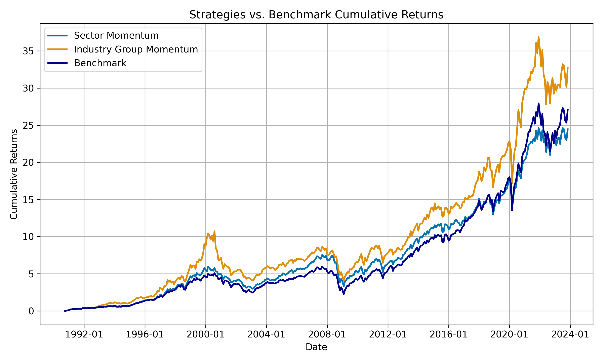

S&P500 Industry and Sector Momentum
==============================

Can the academic US UMD factor be profitably implemented by US sector and industry portfolios after transaction costs? 

Momentum in literature is generally exploited by long only or long/short strategies taking positions in single stocks. However, when attempting to implement these strategies one is confronted with high transaction costs incurred by high turnover. We investigate if the momentum anomaly is exploitable by taking positions in GICS sectors and industry groups as opposed to single stocks, thereby reducing transaction costs due to the lower number of portfolio holdings.

We show that while sector momentum portfolios are not able the beat the benchmark (S&P500) over the full time horizon, industry group momentum portfolio are able to achieve an excess return. 

Please see [SPX_Industry_Momentum](notebooks/SPX_Industry_Momentum.ipynb) for results.

We provide a fully replicable code including the relevant data to replicate our findings - please see below for requirements.

Requirements
==============================

First, environment variable PROJECT_ROOT must point to the project folder; you can set it in the .env file, and python will rely on python-dotenv to set it. Please: 

- Name the .env file "environment_variables.env"
- Store the environment_variables.env in the notebooks folder

